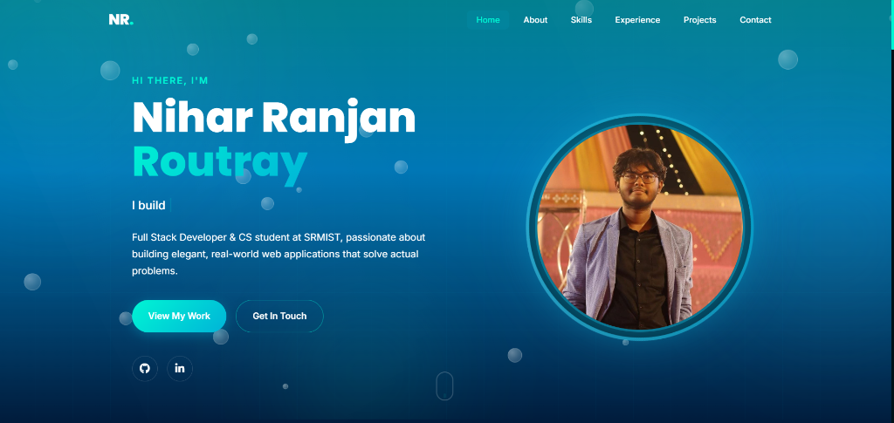

## Live Demo

Try out the live portfolio here: [Nihar Ranjan Routray Portfolio](https://niharrr72.github.io/FUTURE_FS_01/)

# Nihar Ranjan Routray | Professional Portfolio



This repository contains the source code for my professional portfolio website, showcasing my full-stack web development skills, projects, and experiences. It is designed to be highly interactive, performant, and SEO-friendly.

Portfolio Live at : https://niharrr72.github.io/FUTURE_FS_01/

## ✨ Key Features

- **Immersive Custom Design:** Features a unique underwater aesthetic with glassmorphism components, responsive layout, and subtle CSS animations.
- **Dynamic Interactions:**
  - 3D tilt effects on profile photography.
  - Interactive background water ripples that respond to mouse hovers.
  - Staggered entrance animations powered by AOS.js.
- **Projects & Experience Showcase:** Highlights professional roles, volunteering experience, and major full-stack applications (including Future Interns tasks).
- **Functional Contact Form:** Direct-to-email background messaging facilitated by Web3Forms, complete with input validation and a seamless UI.
- **Fully Responsive & SEO Optimized:** Semantic HTML5 structure, comprehensive meta/Open Graph tags, and mobile-first CSS architecture.

## 🛠 Tech Stack

- **Frontend Core:** HTML5, Vanilla CSS3 (Custom Variables, CSS Grid, Flexbox), Vanilla JavaScript
- **Icons:** Font Awesome (CDN)
- **Effects Library:** Vanilla-tilt.js (for smooth 3D interactions)
- **API Integration:** Web3Forms API (Serverless email routing)

## 🚀 Setup & Installation (Local Development)

To run this project locally on your machine and explore the dashboard, follow these simple steps:

1. **Clone the repository:**
   ```bash
   git clone https://github.com/niharrr72/FUTURE_FS_01.git
   cd FUTURE_FS_01
   ```

2. **Serve the files:**
   Because this project uses ES6 modules and external API requests (Web3Forms), it should be served via a local web server rather than opening the HTML file directly in the browser (to avoid CORS issues).
   
   If you have Python installed, you can run:
   ```bash
   python -m http.server 8000
   ```
   *Alternative: Use the "Live Server" extension in VS Code.*

3. **View the application:**
   Open your browser and navigate to `http://localhost:8000`.

## 📦 Deployment (GitHub Pages)

This portfolio is ready natively for GitHub Pages deployment.

1. **Push to GitHub:** Commit your code and push it to a new public repository on your GitHub account.
2. **Enable GitHub Pages:**
   - Go to your repository's **Settings**.
   - Navigate to the **Pages** section on the left sidebar.
   - Under **Build and deployment -> Source**, select **Deploy from a branch**.
   - Under **Branch**, select `main` (or `master`) and `/ (root)` folder, then click **Save**.
3. **Live URL:** After a minute or two, your website will be live at `https://niharrr72.github.io/FUTURE_FS_01/`.

## 📬 Contact

Have questions or want to collaborate? Check out the active contact form on the live site or reach out to me below:

- **Email:** niharroutray72@gmail.com
- **LinkedIn:** [Nihar Routray](https://www.linkedin.com/in/nihar-routray-6b9b72337/)
- **GitHub:** [@niharrr72](https://github.com/niharrr72)

---
*Built with ❤️ by Nihar Ranjan Routray during the Future Interns program.*
